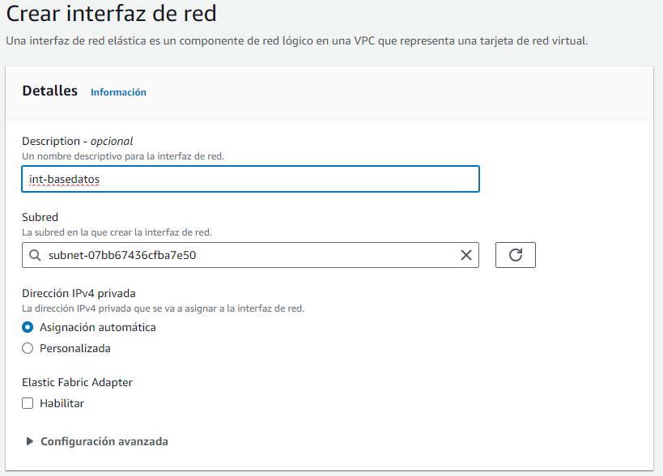

# **LAMP en tres niveles**
#### Marcos de la Marta Núñez

 
 

## VPC

### Primero creamos VPCs.

### Ahora cremaos dos subresdes una para los servidores Apache y otra para nuestro servidor de BBDD.

 
 

## Instancias

### Una vez creada las dos subredes procedemos a crear las instancias.  
### Primero creamos la instancia para el balanceador

### Ahora creamos las instancia para los servidores Apache

### Por ultimo creamos las instancia del servidor MYSQL

### A continuacion creamos dos tarrjetas de red con la sub red de la BBDD para asignarla a los servidores APACHE.

### Depues le demos asignar una IP elastica a la intancia del balanceador.

### Primero creamos una puerta de enlace de internet y la asociamos a la VPC.

### Ahora asociamos la IP elastica a la instacia del balanceador. 

 
 

## Configuraciion balanceador

### Primero debemos editar la tabla de enrutamiento de la VPC y le añadimos una nueva regla para permitir la conexion a la puerta de enlace de internet

### Primero instalamos apache y activamos los modulos proxy_balancer
### Depues editamos el archivo balanceador.conf que está en el directorio /etc/apache2/sites-available:

### Ahora procedemos a instalar certbot y creamos un certificado para el fichero que acabamos de crear

 
 

## Servidores Apache

