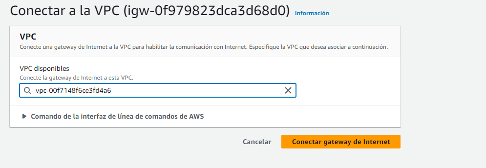
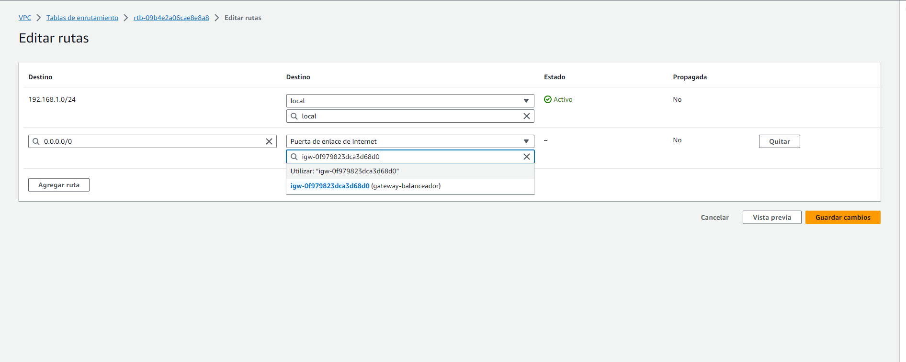

# **LAMP en tres niveles**
#### Marcos de la Marta Núñez

 
 

# Índice.
1. [Introducción.](#introducción)
2. [VPC.](#VPC)
3. [Instancias.](#Instancias)
   * [Servidores Apache.](#servidores-apache)
   * [MySQL.](#Mysql)
   * [Balanceador.](#balanceador)

# Introducción.
 Para establecer la infraestructura, requeriremos la implementación de cuatro máquinas. Una de ellas se designará como el balanceador de carga, mientras que las dos restantes fungirán como servidores web. La última máquina desempeñará el rol de nuestra base de datos. La configuración del balanceador se realizará en la subred pública, mientras que tanto los servidores como la base de datos se desplegarán en la subred privada.
 

En mi caso el dirrecionamiento va a ser el siguiente:
- Subred-Privada (Servidores Apache y servidor base de datos): **192.168.1.128/25** 
- Subred-Public (Balanceador): **192.168.1.0/25**
# VPC
## Balanceador.
### En primer lugar creamos la VPC (Virtual Private Cloud).

### Depues dentro de esa VPC que hemos creado, cremaos dos subresdes una subred que va a tener salida a internet en la que estara elñ balanceador y otra subred privada para nuestros servidor de Backend.

 
 

# Instancias

### Una vez creada las dos subredes procedemos a crear las instancias.  
### Primero crearemos la instancia balanceador.

### Ahora creamos las instancia para los servidores Apache

### Por ultimo creamos las instancia del servidor MYSQL.

### Para que nuestra maquina balanceador tenga salida a internet le demos asignar una IP elastica a la intancia.

### Primero creamos una puerta de enlace de internet y la asociamos a la VPC.

### Ahora asociamos la IP elastica a la instacia del balanceador. 

 
 

## Configuracion balanceador

### Primero debemos editar la tabla de enrutamiento de la VPC y le añadimos una nueva regla para permitir la conexion a la puerta de enlace de internet

### Primero instalamos apache y activamos los modulos proxy_balancer
### Depues editamos el archivo balanceador.conf que está en el directorio /etc/apache2/sites-available:

### Ahora procedemos a instalar certbot y creamos un certificado para el fichero que acabamos de crear

 
 

## Servidores Apache

### Para que nuestra instancias de la red privada tenga acceso a internet debemos crear una gateway nat.

### Despues creamos una tabla de enrutamniento para nuestra subred de la base de datos y le añadimos una ruta para que se conecte a nuestra gateway nat.

### Una vez nuestras intancias tienen conexion a internet procedemos a configurar el servidort apache

### Primero instalo la pila LAMP.

### Hacemos una copia del archivo de configuracion de apache, y editamos el DocumentRoot.

### Ahora activamos la configuracion que acabamos de crear.

### Creamos la carpeta donde vamos a alojar nuestra pagina y descargamos los ficheros desde github.

### Despues configuramos el fichero config.php y ponemos la ip y el nombre de nuestra base de datos.

### Por ultimo reiniciamos el servicio de apache y instalamos el cliente de mariadb.

## Mysql

### Primero instalamos el servidor mariadb.

### Editamos el archivo 50-server.cnf para modificar el bind-address.

### Cargamos el script de la base de datos, creamos el usuario y le damos los permisos para poder usar la base de datos de la aplicación.

### Comprobamos que hay conexion desde nuestro servidor apache a la base de datos.
